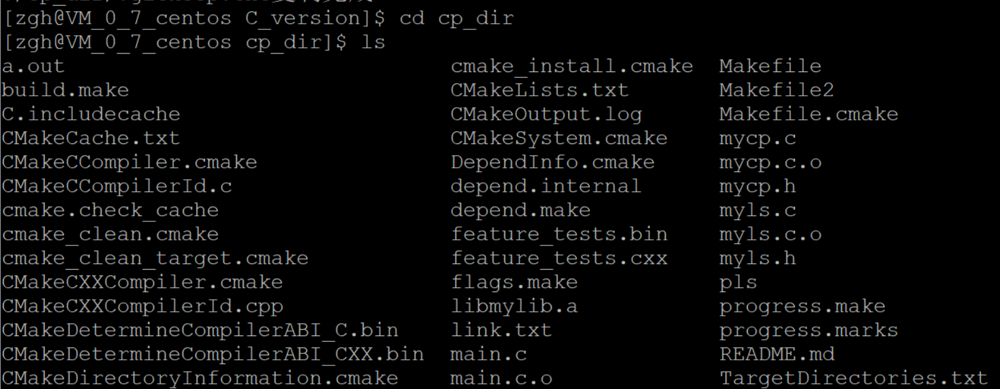
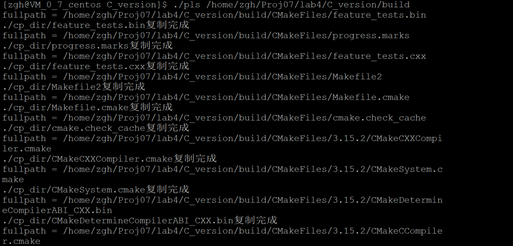

# 实验名称

进程控制实验

# 实验目的

1. 掌握Linux系统创建进程的方法
2. 掌握子代码中如何区别父子进程的方法
3. 掌握父子进程之间的资源共享与异同
4. 掌握等待子进程执行结束的方法
5. 掌握在进程中执行另外一个可执行文件的方法

# 实验内容

**基于文件拷贝（mycp）以及目录遍历（myls）的内容：**

- 改造myls程序作为父进程，其在遍历目录时，对非目录文件创建子进程运行mycp程序。
- mycp源文件路径是父进程myls遍历所获得的文件的路径名（通过命令行参数传递给子进程mycp），并将源文件拷贝到指定目录下（在/home目录下以自己的名字的汉语拼音创建一个目录）。
- 父进程myls等待子进程mycp运次结束，回收其内核空间资源，直到父进程遍历完成。

**在实现基本功能实现的基础上，对程序功能进行扩展，以支持目录的递归遍历并将所有目录及子目录的文件拷贝到一个目录中**

- 如果没有命令行参数则通过getcwd获取当前工作目录
- 如果包含一个命令行参数则通过该参数传递需要遍历的目录
- 如果有超过一个命令行参数则出错
- 拷贝文件及子目录下的文件

# 实验步骤

## 代码实现

1、将myls程序作为父进程，遍历文件夹中的文件和目录，程序对每个文件或者目录创建一个子进程。


2、在子进程中，对目录文件进行递归操作，对非目录文件运行mycp程序。完成子进程后退出。


3、父进程则等待所有的子进程都完成后继续往下执行，使用阻塞模式，第三个参数设置为0则为阻塞，设置为WNOHANG为非阻塞。


## 运行程序

### 编译

进入实验文件目录下，依次运行以下命令：

```
mkdir build
cd build
cmake ..
make
```

产生运行文件pls


### 运行

1、在实验文件目录下，先创建固定文件夹cp_dir

2、执行``./pls`` 表示复制当前目录路径的文件到固定文件夹

- 将当前目录下所有文件复制到cp_dir目录下


- cp_dir文件夹下文件列表



3、执行``./pls [目录路径]``表示复制指定目录到固定文件夹

- 将build目录下的所有文件复制到固定文件夹



- cp_dir文件夹下文件列表


# 心得体会

​        通过本次实验掌握了Linux创建进程的fork方法，掌握通过pid_t值区别父子进程，掌握了父子进程之间资源共享与异同，学习了等待子进程结束的waitpid方法等。
